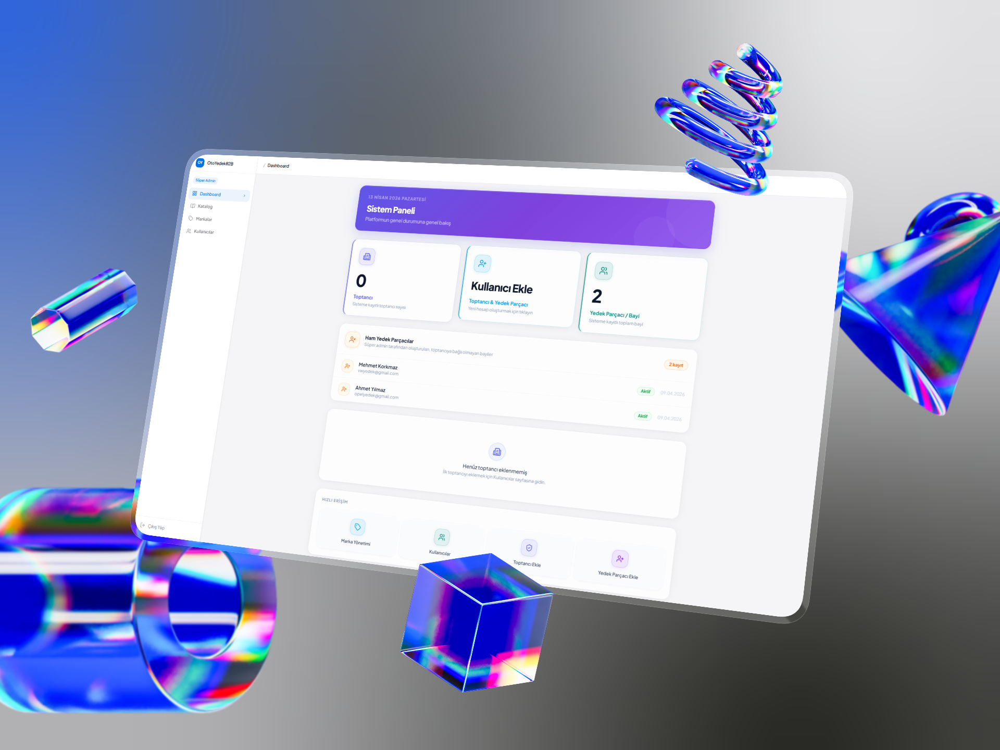
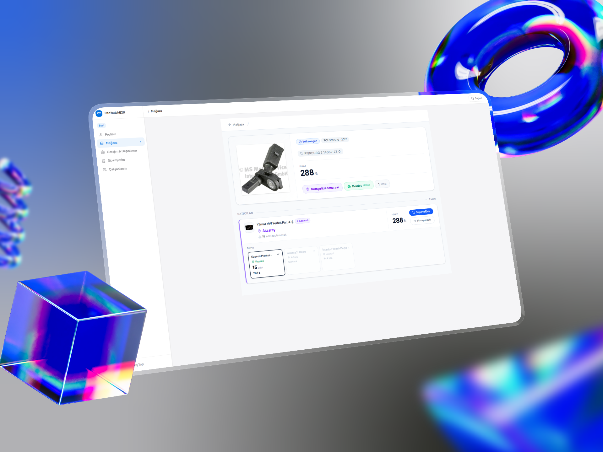
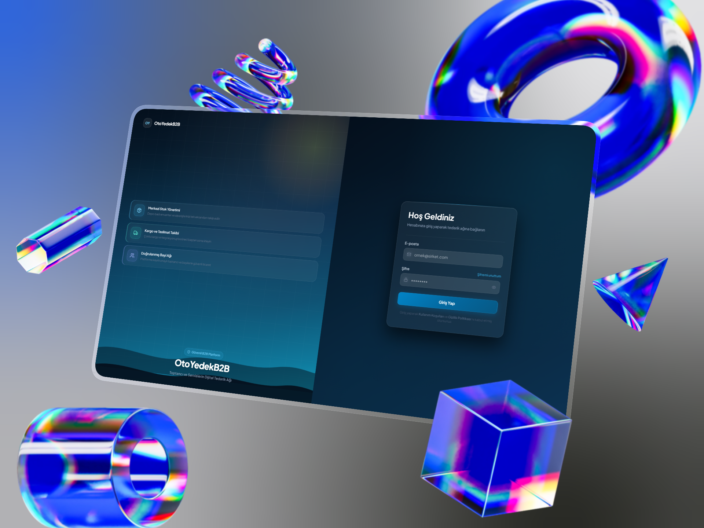

# 🚀 AutoSpare B2B: Modern Spare Parts Management System (Showcase)

> **Note:** This is a showcase repository. The source code is kept private due to NDA and commercial confidentiality.

## 📌 The Problem
The auto spare parts industry heavily relies on outdated, desktop-only legacy software from the early 2010s. These monolithic systems lack mobile responsiveness, have poor UI/UX, and severely slow down daily operations for suppliers and buyers in industrial zones.

## 💡 The Solution
We developed a next-generation, mobile-first B2B platform that digitizes and streamlines the entire spare parts supply chain. By replacing legacy systems with modern database architectures, we provided a seamless, fast, and accessible experience across all devices.

## ✨ Key Features
* 📱 **Mobile-First Architecture:** A fully responsive interface, allowing users to manage inventory, search parts, and place orders directly from the field or warehouse.
* ⚡ **Bulk Data Migration (Excel Parsing):** To eliminate manual data entry, we engineered a bulk upload system via `.xlsx` files, enabling users to update thousands of spare parts in seconds.
* 🗄️ **Real-Time Data & Modern Backend:** Replaced outdated local databases with **Supabase**, ensuring fast queries, secure authentication, and real-time synchronization.
* 🎨 **Modern UI/UX:** A clean, intuitive dashboard designed specifically for end-users who are accustomed to complex and cluttered legacy screens.

## 🛠️ Tech Stack
* **Frontend:** TypeScript, Next.js / React
* **Backend & Database:** Supabase (PostgreSQL)
* **Feature Modules:** Excel Parser, Authentication, Advanced Filtering

## 📸 Interface Previews

### 1. Dashboard & Control Center

### 2. Mobile-First B2B Experience

### 3. Catalog & Part Details

### 4. Secure Authentication

