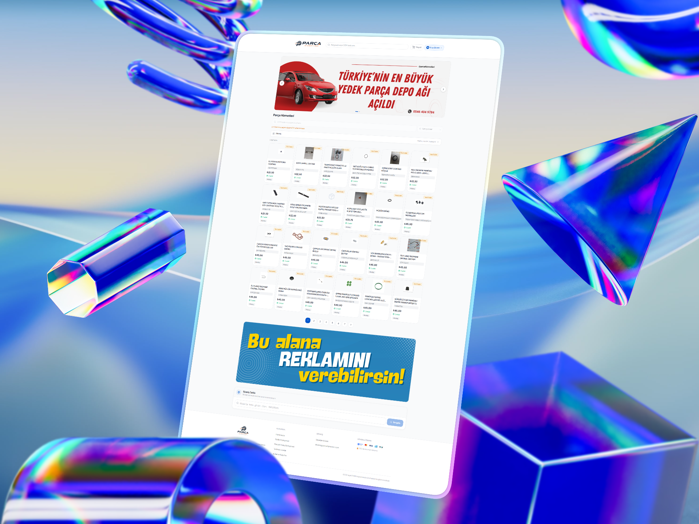
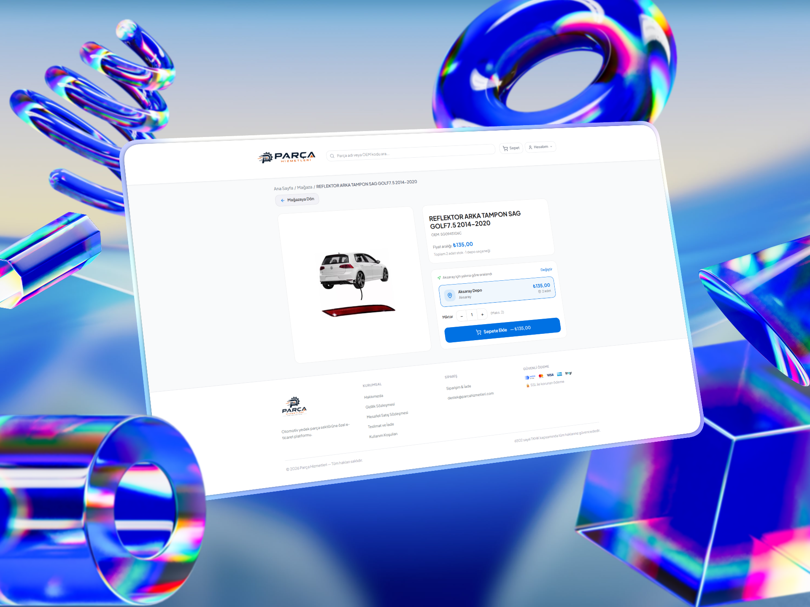
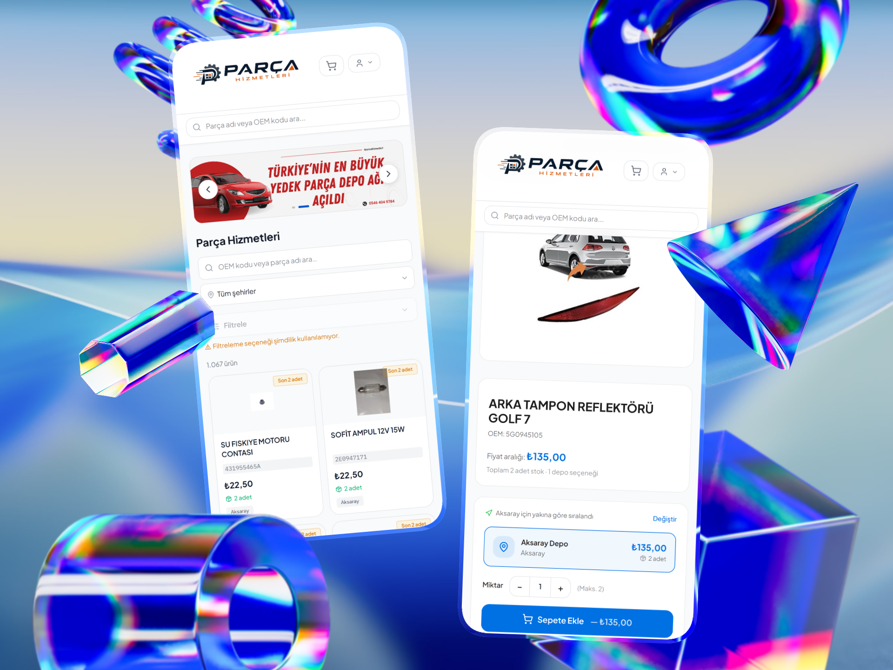

# Parça Hizmetleri: Scalable Auto Spare Parts SaaS & E-Commerce Platform (Showcase)

> **Note:** This is a showcase repository. The source code is kept private due to commercial confidentiality and its proprietary SaaS architecture.

## The Vision & The Solution
The auto spare parts industry is highly fragmented, often relying on localized, outdated desktop software. Parça Hizmetleri is built to change this. It is not just an e-commerce website; it is a scalable SaaS infrastructure designed to manage a nationwide network of spare parts depots, seamlessly connecting complex B2B supply chains with a fast, modern B2C retail experience.

### Centralized SaaS & Depot Management
A complete ecosystem overview. We replaced scattered legacy systems with a unified architecture powered by **Supabase**. It handles everything from multi-location warehouse tracking to dynamic pricing and order fulfillment with zero latency.

---

## Core Capabilities in Action

### Massive Scale & Dynamic SEO
Built to handle a massive catalog of over 200,000+ unique spare parts. We engineered a custom, chunked dynamic XML sitemap generation system that bypasses standard database and execution limitations, ensuring every single part is fully indexed and accessible on search engines.

### Mobile-First B2C/B2B Interface
A fully responsive, lightning-fast UI designed for both mechanics in the warehouse and everyday drivers on the road. It streamlines the complex part-matching process into a clean, intuitive, and high-conversion e-commerce flow without the clutter of legacy systems.

---

## Tech Stack & Engineering Highlights
* **Frontend:** TypeScript, Next.js (App Router), Tailwind CSS
* **Backend & Database:** Supabase (PostgreSQL), Edge Functions
* **Performance & SEO:** Custom programmatic sitemaps, server-side rendering (SSR), and highly optimized URL/slug generation for hundreds of thousands of dynamic routes.
* **Architecture:** Scalable SaaS structure designed for future multi-tenant depot expansion across the country.
